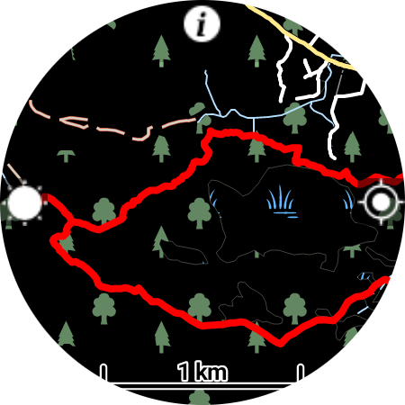

This simple Wear OS app allows doing two things:
* Downloading OSM maps of the whole world for offline use.
* Importing GPX files into the watch, and displaying them on the map so you can follow them.

This app is intended for hiking, trail running and other outdoor sports, so it has the following options:
* Stopping the screen from dimming, for continuous navigation.
* Disabling touch input, to use in the rain or if a piece of clothing covers the screen.
* Displaying progress along an active GPX track.

Instructions:
* Download the offlinemaps.apk file found in this repository and sideload onto your watch.
* Run the app, enable GPS permission.
* Tap and hold the screen to enter the menu, download a map of your area (placing the watch on a charger may help slow download speed)
* When the map is downloaded, and location is acquired, you should see the map drawn on the screen. Swipe the map to scroll it and use rotation input (physical bezel, touch bezel, crown) to zoom in and out.
* Import a GPX track from ridewithgps.com or pastebin.com. For the moment there is no authorization, so your saved tracks need to be public. You'll need to enter 8-digits from the URL when importing from RWGPS.com or the last 8 letters from the paste url.
* Click on the track name to activate it, it will now be shown on the map.
* Click on the "sun" icon on the left of the screen to stop the screen from dimming.
* Click on the "info" icon on the top to toggle the information overlay (clock, battery and track progress).
* Click on the "location" icon on the right to stop the map from centering on your location.
* Press the back button to disable/enable touch input (a "lock" icon will appear on the right when touch is disabled).
